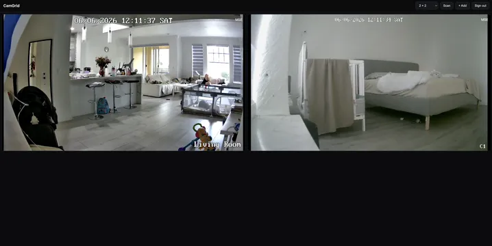

# CamGrid



Self-hosted multiview for IP cameras. Runs in Docker **on your camera network**,
pulls each camera's stream directly, and serves a browser UI you can reach
from anywhere.

The key idea: **the server is local to the cameras, you are remote to the server.**
No P2P, no vendor relay, no NAT-punching — the container talks to cameras on the LAN
(rock-solid direct RTSP), and only the web UI travels over the internet to you.

Two ways to add a camera:

- **By IP** — for Reolink cameras: enter the address + login, CamGrid probes the device
  (model, channels, HTTPS-only firmware) and derives the main/sub RTSP URLs for you.
- **By URL** — for anything else: paste a low/SD stream URL (and optionally a high/HD one).
  Any source go2rtc understands works — `rtsp://`, `http://`, `rtmp://`, etc.

## Features

- **Multiview grid** — live video in the browser via [go2rtc](https://github.com/AlexxIT/go2rtc) (WebRTC, ~0.5s latency, with MSE fallback)
- **Add by IP** (Reolink probe + login, handles HTTPS-only firmware) **or by stream URL** (any camera/source)
- **Layout presets** — Auto (responsive), 2×2, 3×3, 4×4, or 1 + small (one large tile, the rest small); remembered across reloads
- **SD ⇄ HD toggle** per tile — switch between the sub and main stream on the fly
- **Rename** any camera inline; **mute**, **full-page**, and **delete** per tile — controls reveal on hover for a clean view
- **Discovery** — subnet scan that finds Reolink cameras even with ONVIF disabled (their default)
- **PTZ** — pan/tilt/zoom for cameras that support it
- **NVR aware** — enumerates channels
- Single exposed port (go2rtc is proxied), credentials never leave the server

## Run it (on a box at home, on the camera LAN)

```sh
cp .env.example .env        # set AUTH_USER / AUTH_PASS for the web login
docker compose up -d --build
```

The web UI port defaults to **3000**; change it by setting `WEB_PORT` in `.env`
(e.g. `WEB_PORT=8080`) — it drives both the app's listen port and the published port.

Open `http://<that-box-ip>:3000`, sign in, then either click **Scan** / **+ Add** → *By IP*
and enter the camera password, or **+ Add** → *By URL* and paste the stream URL(s). Done.

## Authentication

The UI requires a login, configured by env vars:

| Var | Default | Meaning |
|-----|---------|---------|
| `AUTH_USER` | `admin` | login username |
| `AUTH_PASS` | *(none)* | login password — **if empty, the UI is OPEN** |
| `SESSION_DAYS` | `30` | how long the session cookie lasts |
| `LOCKOUT_ATTEMPTS` | `5` | failed logins per IP before lockout |
| `LOCKOUT_MINUTES` | `15` | lockout duration |
| `TRUST_PROXY` | `1` | reverse-proxy hops to trust for client IP / scheme |

- Sessions are an **HMAC-signed, expiring cookie** (HttpOnly, SameSite=Lax, Secure when
  served over HTTPS) — no password re-entry until it expires or you sign out.
- **Brute-force lockout** is per client IP: after `LOCKOUT_ATTEMPTS` failures, that IP is
  blocked for `LOCKOUT_MINUTES`. The signing secret persists in `data/session.secret`.
- The login also gates the **stream WebSockets**, so video can't be viewed unauthenticated.

> **Linux host** (recommended): `network_mode: host` (default) lets the server scan the
> subnet and reach cameras directly.
>
> **Docker Desktop (Mac/Windows)**: host networking isn't supported — switch to the
> `ports:` service in `docker-compose.yml`. Subnet scan won't work in bridge mode, so
> add cameras by IP manually.

## Data & persistence

All state lives in one folder, **bind-mounted from the host** so it survives container
rebuilds. It defaults to `./data` next to `docker-compose.yml`; point it elsewhere by
setting `DATA_PATH` in `.env` (e.g. `DATA_PATH=/srv/camgrid/data`).

| File | Contents |
|------|----------|
| `cameras.json` | Saved cameras — for IP cameras this includes the host and **plaintext password**; for URL cameras, the stream URLs (which may embed credentials) |
| `go2rtc.yaml` | Generated stream config (regenerated on boot; embeds RTSP URLs with auth) |
| `session.secret` | Login-cookie signing key (persists so sessions survive restarts) |

> **Keep this folder private.** Credentials are stored in the clear. Don't commit it,
> and lock down its filesystem permissions. The browser never receives credentials —
> the server strips them before sending camera data to the UI.

## Reaching it remotely

The container only needs its **one web port** exposed. Pick whichever you trust:

- **Tailscale** (recommended) — `tailscale up` on the home box; browse to its tailnet IP
  from anywhere. Encrypted, nothing exposed to the public internet.
- **Cloudflare Tunnel** — `cloudflared tunnel --url http://localhost:3000` for a public
  HTTPS URL with no port-forwarding.
- **Port-forward** `3000` on your router (least secure; put auth in front of it).

Because it's one HTTP port, any of these "just work" — including the WebRTC/MSE streams,
which are proxied through that same port.

## Behind nginx — yes

It works behind nginx (or any reverse proxy). Two things matter:

1. **Proxy the WebSocket upgrade** — the streams use WebSockets, so the proxy must pass
   `Upgrade`/`Connection` headers.
2. **Forward `X-Forwarded-For` and `X-Forwarded-Proto`** — so per-IP lockout sees the real
   client (not nginx's IP) and the session cookie is marked `Secure` over HTTPS. The app
   already does `trust proxy` (`TRUST_PROXY`, default 1 hop).

A ready config is in **`nginx.example.conf`** — point it at `127.0.0.1:3000` and you're
done. Note: over a proxy, streams use the **MSE** path (HTTP/WS) — WebRTC's low-latency
UDP needs go2rtc's `:8555` reachable, which a plain HTTP proxy doesn't carry; MSE works
fine through nginx (~1s latency).

## How it fits together

```
browser ──HTTP/WS──> CamGrid (Node/Express)
                       ├── /api/*        camera mgmt, discovery, PTZ (Reolink CGI)
                       ├── /go2rtc/*  ─proxy─> go2rtc ──RTSP/…──> cameras (LAN)
                       └── /          static web UI (multiview + PTZ)
```

- `server/reolink.js` — Reolink CGI client (login, device info, PTZ, RTSP URLs)
- `server/discovery.js` — subnet RTSP sweep + Reolink verification
- `server/go2rtc.js` — manages the go2rtc process + streams over its API
- `server/index.js` — HTTP API, go2rtc proxy, static UI
- `web/` — the multiview front-end

## Notes / next steps

- The UI has **built-in login** (see [Authentication](#authentication)) — just set a strong
  `AUTH_PASS` before exposing it. If you leave `AUTH_PASS` empty, the UI is open, so put a
  reverse proxy / Tailscale in front instead.
- Recordings/playback, two-way audio, and event/AI overlays are not implemented yet.
- Credentials are stored **in the clear** in `cameras.json` inside the host data folder
  (see [Data & persistence](#data--persistence)) — keep it private; at-rest encryption isn't implemented yet.
